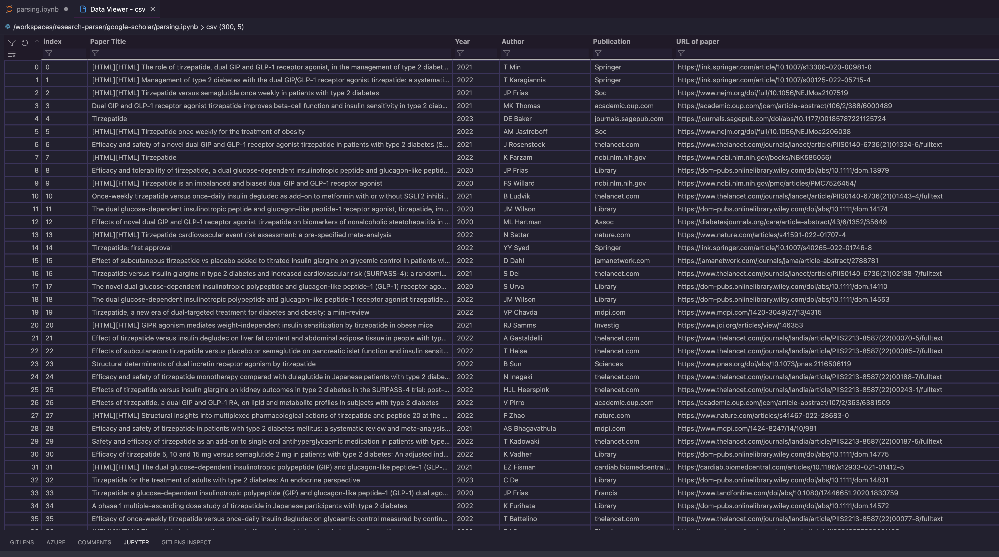

<!-- Add Google Scholar Logo -->
<p align="center">
  
</p>

# Google Scholar Web Scraping and CSV Creation

This Jupyter Notebook allows you to scrape Google Scholar search results, extract paper information, and create a CSV file with the following columns: Paper Title, Year of Publication, Author, Publication Journal, and URL of the Paper.

<!-- Add Jupyter Notebook Logo -->
<p align="center">
  
</p>

## Sample Output


## Prerequisites

Before using this notebook, make sure you have the following:

- Python 3.10 installed
- Required libraries installed (you can install them using `pip`:
  - `requests`
  - `beautifulsoup4`
  - `pandas`

## Usage

1. Clone or download this repository to your local machine.

2. Open the Jupyter Notebook `parsing.ipynb` in your Jupyter Notebook environment.

3. Modify the `url` variable to specify your Google Scholar search query. For example, you can change `"tirzepatide"` to your desired search term.

   ```python
   url = "https://scholar.google.com/scholar?start=0&q=tirzepatide&hl=en&as_sdt=0,5"
